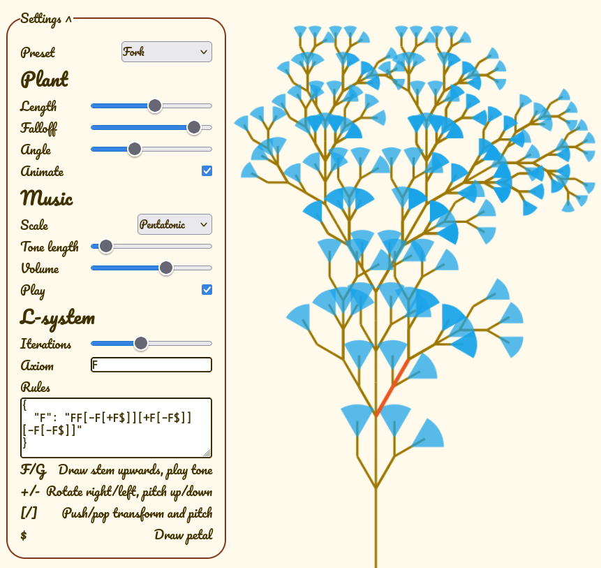

# L-system garden

Pure JS implementation of Lindenmayer systems, with adjustable parameters and rules.  
The systems are evaluated as both plants and music.  
Most presets are taken from _The Algorithmic Beauty of Plants_ by Prusinkiewicz and Lindenmayer.  
See _Growing Music: musical interpretations of L-Systems_ by Worth and Stepney for this and other musical interpretations of L-systems.

[Try it here!](https://toberge.github.io/lsystem)

